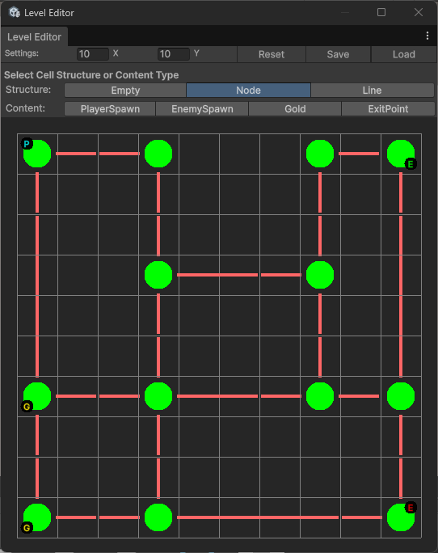

# Chrono Heist ⏱️💎

> **A Turn-Based Tactical Puzzle Game with Time Manipulation Mechanics.** > *Inspired by Hitman GO and Lara Croft GO.*

## 📖 About The Project

**Chrono Heist** is a strategic puzzle game built with **Unity (URP)**. The player navigates a grid-based world to steal artifacts and escape without getting caught by enemies.

The core innovation of the project is the **Time Scrubbing System**. Instead of a traditional "Game Over" screen, players must rewind time (Undo/Redo) to correct their mistakes when caught, turning failure into a gameplay mechanic.

---

## 🎮 Key Features & Mechanics

* **Turn-Based Gameplay:** Precise synchronization between Player and Enemy turns using a State Machine.
* **Time Manipulation (The "Must Undo" System):** A robust Command Pattern implementation allows players to scrub through their action history.
* **Smart Enemy AI:** Chaser enemies use **BFS (Breadth-First Search)** pathfinding to corner the player dynamically.
* **Data-Driven Level Design:** Levels are built using ScriptableObjects and a Custom Editor Tool, keeping data separate from logic.
* **Optimized Rendering:** Uses `MaterialPropertyBlock` for efficient highlighting without breaking GPU Instancing.

---

## 🛠️ Technical Architecture & Design Patterns

This project relies heavily on software design patterns to ensure modularity, testability, and performance.

### 1. Command Pattern (The Core)
To achieve the "Time Rewind" mechanic, every action in the game is encapsulated as an object.

* **Why:** We needed a way to store, execute, and undo complex turn logic (Player move + Enemy moves + Item collection) as a single unit.
* **Implementation:** `ICommand` interface creates a contract. `MoveCommand` and `CollectCommand` implement logic. `CommandManager` maintains a `List<ICommand>` acting as a history buffer, allowing random access (scrubbing) to any past state.

### 2. Finite State Machine (Turn Management)
The game loop is controlled by a strict State Machine within the `TurnManager`.

* **Why:** To prevent race conditions between Player input and Enemy AI processing.
* **States:** `PlayerTurn` -> `Execution` -> `EnemyTurn` -> `LevelCompleted` or `Caught`.
* **Flow:** Inputs are locked during execution states, ensuring deterministic gameplay.

### 3. Observer Pattern (Event System)
Decoupling is achieved using a custom, struct-based Event Manager.

* **Why:** To allow systems (like UI, Audio, and Gameplay) to communicate without direct dependencies.
* **Optimization:** Uses `structs` for event payloads to minimize Garbage Collection (GC) allocation, crucial for mobile performance.

### 4. Data-Driven Design (ScriptableObjects)
Levels are not stored as scenes but as data assets (`NodeDataSO`).

* **Why:** Enables rapid level iteration, smaller build sizes, and easier version control. A single scene can load any level data dynamically.

### 5. Bootstrapper Pattern (Initialization)
A centralized `GameManager` acts as a bootstrapper to handle the "Initialization Hell" problem.

* **Why:** To guarantee that Managers initialize in the correct order (Input -> Event -> Grid -> Turn) without relying on Unity's unpredictable `Start()` execution order.

---

## 🧰 Custom Tools

### Level Node Editor
To facilitate the Data-Driven workflow, a custom Editor Window was developed.

* **Features:**
    * **Paint Mode:** Left-click to place nodes, Right-click to remove.
    * **Smart Connections:** Automatically calculates line connections and angles.
    * **Content Painting:** Easily place Player, Enemies, Gold, and Exits using a toolbar.

---

## 📂 Code Structure

The project follows a domain-centric folder structure:

Assets/Scripts/
├── Abstracts/     # Interfaces (IMovable)
├── Command/       # Command Pattern Logic & Management
│   ├── CommandManager.cs  # Command history and time scrubbing
│   ├── ICommand.cs        # Command contract
│   ├── MoveCommand.cs     # Movement command
│   ├── CollectCommand.cs  # Item collection command
│   └── TurnBatchCommand.cs # Composite command for a full turn's actions
├── Core/          # Central Managers & Core Systems
│   ├── GameManager.cs     # Bootstrapper and high-level control
│   ├── GridManager.cs     # Grid/Level generation
│   ├── TurnManager.cs     # Turn loop and State Machine
│   ├── SelectionManager.cs # Input-to-World interaction
│   ├── EventManager.cs    # Decoupled communication system
│   └── Pathfinding.cs     # BFS Algorithm (Static)
├── Editor/        # Custom Editor Tools (NodeEditor)
├── Enemy/         # AI Logic (EnemyController)
├── Input/         # Input System wrapper (InputReader)
├── Node/          # Grid data structures (GameNode, GridCellData, NodeDataSO)
├── Player/        # Player Controller
├── UI/            # User Interface Logic (UIManager, Scrubber)
└── Utilities/     # Helper Classes (Logger, Manager Base, CHRLibrary)

---

## 🚀 Installation & How to Play

1.  Clone the repo: `git clone https://github.com/username/ChronoHeist.git`
2.  Open in **Unity 6000.0.x** (or compatible version).
3.  Open `Assets/Scenes/SampleScene`.
4.  Press **Play**.
5.  **Controls:**
    * **Left Click:** Move / Interact.
    * **Z:** Quick Undo.
    * **UI Slider:** Scrub through time timeline.

---

## 📝 License

Distributed under the MIT License. See `LICENSE` for more information.

---
*Developed by eraykt*
